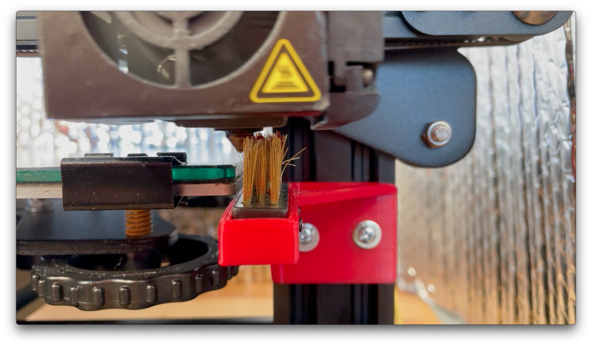

# Ender3NozzleCleaner
Easy and automatic nozzle cleaning for and Ender 3 Pro with an inexpensive brush.

PETG is quite stringy and having strings of filament on your first layer is quite annoying. To avoid babysitting each print, I looked at a couple of designs on thingiverse but none really worked well for an Ender 3 Pro.

## What you need

* Cheap brass brush - in this design I used a [sub-1$ one from Harbor Freight](https://www.harborfreight.com/brass-detail-brush-69524.html)
* 2 or 3 M1.7 screws (or equivalent very small and short screws)
* T-Nut (you can 3d print [this M3 Tnut](https://www.thingiverse.com/thing:3050607) )
* Brush support

## How-to

* 3d print brush support (both STL and Fusion360 files are provided)
* 3d print Tnuts (or buy/reuse other ones)
* Cut away the brush handle: keep the part where the brass brush is
* Extend limits of your printer: in my case I found that I can safely extend X to 248 mm
* Write a sequence of Gcode commands that moves the head back and forth (see examples at [nozzle_clean.gcode](nozzle_clean.gcode) and [g12_macro_klipper.cfg](g12_macro_klipper.cfg) )

## End result



In action:

* [Overall](https://youtu.be/dVcODpnYj88)
* [Closeup](https://youtu.be/zQN17WtxQjo)

## Tip: Klipper Macro for G12

A good option is to define the cleaning code as G12 and use a macro in klipper.
See code at [g12_macro_klipper.cfg](g12_macro_klipper.cfg)

## Tip: mounting the support
The support it works best when the display is removed. If the display is not removed, you need to offset Z commands upwards in the examples provided.

## Tip: extending printer bed size

I use Klipper and I simply modified the `printer.cfg` file to account for a larger X dimension

```
[stepper_x]
#...
position_endstop: 0
position_max: 248
```

Do not modify your slicer, it might think there is more bed than there is 
